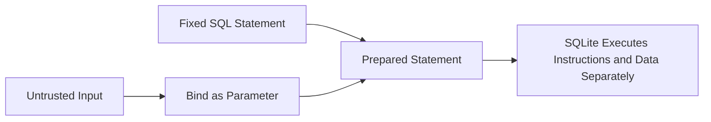

<div align="center">

# C++ Secure Coding Labs

### Educational security exercises covering memory safety, testing, analysis, injection risks and secure software design


[Modules](#portfolio-modules) · [Security Scope](#security-scope) · [Remediations](#secure-remediations) · [Documentation](#project-documentation) · [Use](#how-to-use)

</div>

---

## Overview

This repository preserves a collection of C++ secure-software exercises originally developed through secure-coding coursework. The modules examine common software risks through source code, tests, reports and policy documentation.

The portfolio now separates **original educational demonstrations** from **safer remediation guidance**. This is important because some exercises intentionally contain limited, weak or vulnerable behavior so that the underlying security issue can be studied.

> [!IMPORTANT]
> Not every original module is production-safe. Read the security scope and limitation notes before reusing any code.

## Portfolio Modules

| Module | Focus | Portfolio Value |
|---|---|---|
| [Static Code Analysis](./Static-Code-Analysis/) | Analysis reports and supporting evidence | Demonstrates defect discovery and security review |
| [XOR Transformation Demonstration](./Encryption/) | Reversible transformation and file processing | Demonstrates data transformation flow, while documenting why custom XOR is not secure encryption |
| [Unit Testing](./Unit-Testing/) | Visual Studio C++ tests | Demonstrates requirements-based verification and failure testing |
| [Exception Handling](./Exception-Handling/) | Predictable error behavior | Demonstrates controlled failure paths and defensive handling |
| [Memory Safety](./Memory-Safety/) | Buffer boundaries and overflow risk | Demonstrates unsafe memory behavior and prevention concepts |
| [Injection Prevention Exercise](./Injection-Prevention/) | SQL injection attack-pattern demonstration | Shows injection behavior and why parameterized queries are the stronger control |
| [Security Policy](./Security-Policy/) | Secure software governance | Connects engineering behavior to policy and lifecycle expectations |
| [Reflection](./Reflection/) | Portfolio analysis | Summarizes lessons learned across the security modules |

## Security Scope

| Module | Important Limitation | Production Direction |
|---|---|---|
| XOR transformation | Repeating-key XOR and a hardcoded key do not provide modern confidentiality or integrity | Use a reviewed library with authenticated encryption such as AES-GCM or ChaCha20-Poly1305 |
| Injection exercise | Detecting suspicious text patterns can be bypassed | Use prepared statements and parameter binding |
| Memory-safety demonstrations | Some files may intentionally illustrate unsafe behavior | Prefer bounded containers, validate lengths and use compiler sanitizers |
| Unit tests | Passing tests do not prove the absence of vulnerabilities | Combine tests with review, static analysis, sanitizers and threat modeling |
| Static analysis | Tool output depends on rules and code coverage | Integrate analysis into CI and review findings continuously |

### Cryptography clarification

The code in [`Encryption/Encryption.cpp`](./Encryption/Encryption.cpp) performs a repeating-key XOR transformation. It is useful for demonstrating reversible processing, but it is **not secure encryption** and should not be used to protect real information.

The original example hardcodes a key and writes key material into an output file. Those behaviors are preserved as coursework evidence and explicitly documented as practices that should not appear in production software.

### SQL injection clarification

The original [`Injection-Prevention/SQLInjection.cpp`](./Injection-Prevention/SQLInjection.cpp) recognizes selected tautological `OR value=value` patterns. This can demonstrate what an injection attempt looks like, but pattern matching is not a reliable primary defense.

The correct design keeps SQL instructions separate from untrusted data through prepared statements and parameter binding.

## Secure Remediations

The [`secure-remediations/`](./secure-remediations/) folder adds safer follow-up work without erasing the original submissions.

### [Parameterized SQLite Query Example](./secure-remediations/ParameterizedQueryExample.cpp)

This example demonstrates:

- a fixed SQL template
- `sqlite3_prepare_v2`
- `sqlite3_bind_text`
- `sqlite3_step`
- attack strings treated as data rather than executable SQL
- no plaintext password field in the demonstration



Read the [remediation notes](./secure-remediations/README.md) for build guidance and cryptography recommendations.

## Project Documentation

The full documentation reviews every module, explains technical limitations, distinguishes educational exercises from production controls and outlines recommended future improvements.

<p align="center">
  <a href="./docs/CPP-Secure-Coding-Portfolio-Documentation.md"><strong>View Project Documentation</strong></a>
  &nbsp;•&nbsp;
  <a href="./docs/CPP-Secure-Coding-Portfolio-Documentation.md?raw=1"><strong>Download Documentation</strong></a>
</p>

## How to Use

Clone the repository:

```bash
git clone https://github.com/rypeguero/Secure-Software-Portfolio-CPP.git
cd Secure-Software-Portfolio-CPP
```

Most source files can be reviewed directly. Some original modules include Visual Studio project files and may require their original Windows development environment.

### Build the parameterized-query remediation

With a C++17 compiler and SQLite development library installed:

```bash
g++ -std=c++17 secure-remediations/ParameterizedQueryExample.cpp -lsqlite3 -o parameterized-query
./parameterized-query
```

## Repository Structure

```text
Secure-Software-Portfolio-CPP/
├── Static-Code-Analysis/
├── Encryption/
├── Unit-Testing/
├── Exception-Handling/
├── Memory-Safety/
├── Injection-Prevention/
├── Security-Policy/
├── Reflection/
├── secure-remediations/
│   ├── ParameterizedQueryExample.cpp
│   └── README.md
├── docs/
│   └── CPP-Secure-Coding-Portfolio-Documentation.md
└── README.md
```

## Repository Cleanup Notes

The repository was cleaned for readability and cloneability. Compiled binaries, Visual Studio caches, debug output, duplicate archives and local IDE metadata were removed while source code, project files, reports and portfolio documentation were preserved.

A large presentation from the original export was intentionally excluded because it was approximately 94 MB. A file of that size is better stored as a GitHub Release asset rather than committed to the main repository history.

## Concepts Demonstrated

`C++` · `Secure Coding` · `Memory Safety` · `Exception Handling` · `Input Validation` · `Unit Testing` · `Static Analysis` · `SQLite` · `Prepared Statements` · `Parameter Binding` · `Injection Prevention` · `Security Policy` · `Secure SDLC`

## Recommended Next Improvements

- add CMake files for portable builds
- add automated compilation, tests and static analysis through GitHub Actions
- add before-and-after memory-safety examples verified with AddressSanitizer
- replace the XOR exercise with a separate reviewed-library cryptography demonstration
- expand parameterized queries to include insert and update operations
- add regression tests for each corrected vulnerability

---

<div align="center">

**Ryan A. Peguero · Computer Science · Software Engineering & Cybersecurity**

</div>
