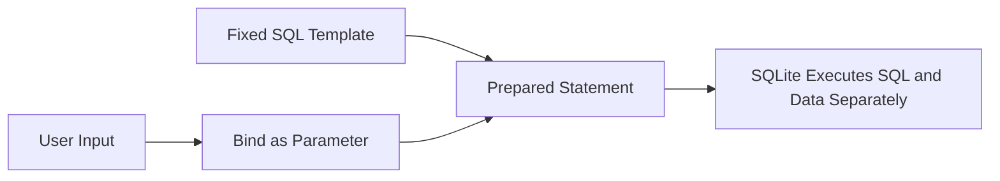

# C++ Secure Coding Portfolio: Project Documentation

## Portfolio Purpose

This repository preserves a collection of C++ secure-coding exercises covering memory safety, exception handling, input validation, unit testing, static analysis, injection risks, reversible data transformation and security-policy work.

The exercises are educational artifacts. Some modules intentionally demonstrate weak or vulnerable behavior so the associated risk can be examined. The repository therefore distinguishes between:

- an original coursework demonstration
- the security lesson it teaches
- the control that should be used in production software

## Module Review

| Module | Educational Focus | Important Limitation | Production Direction |
|---|---|---|---|
| Static Code Analysis | Identifying defects through analysis tools and reports | Findings depend on tool configuration and reviewed code | Integrate analysis into CI and triage findings continuously |
| XOR Transformation (`Encryption/`) | Reversible transformation, file handling and key-driven processing | Repeating-key XOR with a hardcoded key is not secure encryption | Use a reviewed library with authenticated encryption and external key management |
| Unit Testing | Verifying expected and failure behavior | Test value depends on coverage and meaningful assertions | Add boundary, negative, regression and integration tests |
| Exception Handling | Predictable failure behavior | Catching exceptions alone does not correct unsafe state | Validate early, preserve invariants and log failures safely |
| Memory Safety | Buffer boundaries and overflow risks | Demonstration code may intentionally contain unsafe behavior | Prefer bounded containers, automatic storage and compiler sanitizers |
| Injection Prevention | Recognizing suspicious SQL patterns | Pattern matching can be bypassed and is not a primary defense | Use prepared statements and parameter binding |
| Security Policy | Governance and secure-development expectations | Policies are ineffective without ownership and verification | Map policy requirements to engineering controls and review evidence |
| Reflection | Lessons learned across the portfolio | Reflection is descriptive rather than executable | Connect findings to measurable remediation work |

## Original SQL Injection Exercise

The original injection-prevention module builds SQL strings and looks for patterns such as tautological `OR value=value` clauses. That is useful for visualizing an attack, but it should not be described as comprehensive SQL injection prevention.

Reliable prevention keeps user-controlled data separate from SQL instructions. The remediation example in [`secure-remediations/ParameterizedQueryExample.cpp`](../secure-remediations/ParameterizedQueryExample.cpp) uses:

- `sqlite3_prepare_v2`
- a fixed SQL statement
- `sqlite3_bind_text`
- `sqlite3_step`
- no string concatenation of user input into SQL



## XOR Transformation Exercise

The original `Encryption/Encryption.cpp` performs a repeating-key XOR transformation. Because the same operation reverses the output, the module can demonstrate encryption/decryption flow at a basic programming level.

It is not suitable for protecting real information because:

- the key is hardcoded
- the key is written into an output file
- repeating-key XOR is vulnerable to analysis
- the output lacks authentication and integrity protection
- nonce and key-management requirements are absent

A production design should use a reviewed library and an authenticated-encryption mode such as AES-GCM or ChaCha20-Poly1305. Secret keys should come from a protected configuration or key-management system rather than source code.

## Memory-Safety Direction

For memory-safety work, the strongest portfolio framing is not merely that a buffer overflow exists, but that secure development should prevent it through layers such as:

1. validating lengths before copying or indexing
2. preferring `std::string`, `std::vector` and bounded abstractions
3. avoiding unchecked C string functions
4. enabling compiler warnings and treating important warnings as errors
5. using AddressSanitizer or equivalent runtime instrumentation
6. adding unit tests around boundary conditions
7. reviewing ownership and lifetime assumptions

## Testing and Analysis

Security-focused testing should include:

- expected valid behavior
- malformed and missing input
- minimum and maximum lengths
- off-by-one boundaries
- duplicate and unexpected state
- resource failure
- exception paths
- regression tests for corrected vulnerabilities

Static analysis should complement rather than replace code review, tests, runtime sanitizers and dependency review.

## Repository Organization

```text
Secure-Software-Portfolio-CPP/
├── Static-Code-Analysis/
├── Encryption/
├── Unit-Testing/
├── Exception-Handling/
├── Memory-Safety/
├── Injection-Prevention/
├── Security-Policy/
├── Reflection/
├── secure-remediations/
│   ├── ParameterizedQueryExample.cpp
│   └── README.md
├── docs/
│   └── CPP-Secure-Coding-Portfolio-Documentation.md
└── README.md
```

## Portfolio Interpretation

The strongest interpretation of this repository is not that every original exercise represents current production practice. Its value is that it documents multiple classes of software weakness, preserves the original learning artifacts and adds clearer remediation guidance where a stronger control is needed.

## Recommended Future Work

- Add parameterized insert and update examples in addition to the prepared SELECT query.
- Replace plaintext credential examples with non-sensitive sample fields.
- Add a small cryptography example based on a reviewed library rather than a custom cipher.
- Add cross-platform build instructions or CMake projects for the portable modules.
- Add automated builds, unit tests and static analysis through GitHub Actions.
- Add before-and-after memory-safety examples verified with AddressSanitizer.
